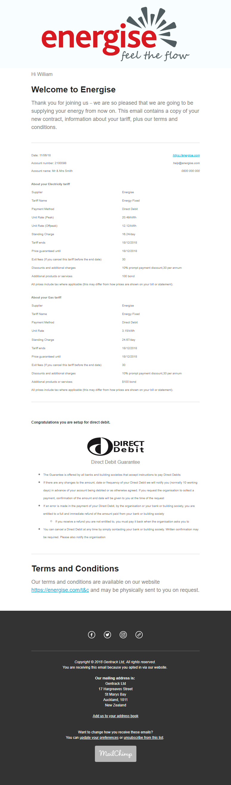
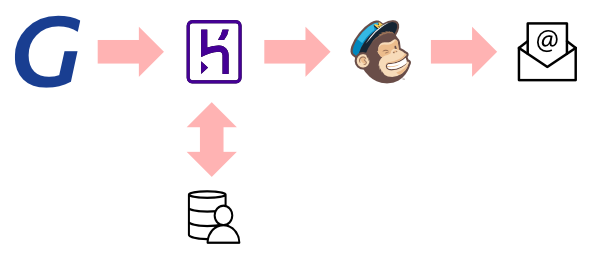

# Welcome Home

Positive customer experience in onboarding reflects on your brand and can drive high value referral from a customer's closest network. So when a new customer signs up it is important that you put your best foot forward to welcome them. In this demo we show how you can use [MailChimp](https://mailchimp.com/), a best-in-class marketing automation tool, to drive your welcome pack experience. This opens up potential for sending people on different welcome journeys depending on how they came to be a customer, A/B testing options to drive further engagement, and all of the great features you expect from marketing automation.

In this demo we connect the Gentrack Cloud Integration Services (GCIS) to an integration layer, represented by Heroku. This layer extracts a bit of extra data that might typically reside in a CRM, and sends the combined set to Mailchimp to trigger the automation pathway. The process flows as follows:

1. Deploy an integration to orchestrate the customer welcome message workflow
2. Subscribe to event(s) via the GCIS Developer Portal to be received by your integration layer
3. GCIS picks up the event and packages it up to send to your integration layer via a webhook
4. Your integration layer enriches the event with other information from around your organization then sends it to the marketing automation tool
5. Your marketing automation tool initiates the welcome pack communications journey

As you think about your production deployment you might choose other methods for integration (e.g. event bus, workflow-based integration layer, etc...). Our sample integration layer also hosts a simple data set that might be obtained from a customer relationship management (CRM) system. You will also want to consider how to secure secrets, such as API keys, in your integration layer.

## Before you begin

You will need to have:

* [GCIS Developer Portal](https://portal.integration.gentrack.cloud/) Account - contact your organization administrator to get an invite, or your account manager to enroll your organization
* [MailChimp](https://mailchimp.com/) Account
* [Heroku](https://www.heroku.com/) Account

## Obtain MailChimp API key and GCIS app public key

Before you deploy the integration you will need an API key for MailChimp to pre-configure and push events to its API. You will also need the public key of your GCIS app definition to verify that received events are valid.

1. Sign in to [MailChimp](https://admin.mailchimp.com/)
2. Navigate to your account, locate the [API keys](https://admin.mailchimp.com/account/api/) in the Extras section, and generate a new API key - save it for later
3. Sign in to the [GCIS Developer Portal](https://portal.integration.gentrack.cloud/)
4. Add a new app using your non-production tenant
5. Open the app settings and copy the public key - save it for later

## Deploy the sample integration on Heroku

It is time to deploy the integration. This will setup an app in Heroku to connect MailChimp and GCIS, and create a new MailChimp list to receive new customers.

1. Click on the **Deploy to Heroku** button below, to create a new instance of this sample integration:

    
2. On the __Create New App__ populate the following values then click **Deploy app**
    * App name - provide a value, or leave it blank to let Heroku generate a value
    * Region - chooses a region that suits you
    * APP_PUB_KEY - paste the GCIS public key you obtained earlier
    * MAILCHIMP_API_KEY - paste the MailChimp API key you obtained earlier
    * MAILCHIMP_LIST_NAME - provide a name for a new list in MailChimp which we will create for the integration (e.g. "Energise Me"), be aware this is also used as the organization name in the starter email template.

Once the application is deployed you will be able to access the integration console at `https://(your-app-name).herokuapp.com/admin`.

## Configure the MailChimp campaign

Now that the integration is setup, it is time to wire up an automated campaign which is triggered with each new entry to a list. We will use a pre-created "Welcome Pack" email template which has the merge fields pre-populated:

1. [Click to import our starter "Welcome Pack" email template](https://admin.mailchimp.com/templates/share?id=90164641_cdfd77dd092f71ce6ef6_us17)
2. Create a new campaign
3. In the **Search our available campaign types** box enter **Welcome new subscribers** and select the list you specified during the integration setup
4. Once the campaign is created, in the middle of the screen, next to **Trigger**, click on **Edit**
5. On the **Edit Trigger** page set **Delay** to **immediately**, then click **Update Trigger** to return to the setup wizard
6. On the setup wizard, click **Edit Workflow Settings**
7. On the **Workflow configuration** page set the **From name** and **From email address** to valid values then click **Update settings**
8. On the setup wizard step, click **Design Email**
9. On the **Email information** page set the **From name** and **From email address** to valid values and click **Next**
10. On the **Select a template** page under **Saved templates** select the **Welcome Pack** template
11. On the message design screen review the design, then click **Save and Continue** to return to the setup wizard
12. At the bottom of the setup wizard, click **Next**
13. On the **Review your workflow** page ensure there are no issues, then click **Start Sending**

**NOTE**: To preserve the drag-and-drop capability of email templates, you need to import templates using the share template functionality. MailChimp has an HTML import API but it appears to disable the use of the visual editor at the time of this writing.

## Add a sample user to the integration layer CRM dataset

As we are simulating an external dataset that might come from a CRM you will need to add a record that will match with the test event you will send:

1. Sign in to the integration console (you can find it at `https://(your-app-name).herokuapp.com/admin`) 
    *  Username = `admin` and Password = `integrations-are-fun!`
2. Under the section **Welcome Pack Orchestration** section, next to **Customers** click on **Add**
3. On the **Add customer** page provide the following and then click **Save**:
    * Account ID - provide a value that you will use in the test event (e.g. 12345678)
    * First Name - provide a value that will be used as the customer's first name
    * Last Name - provide a value that will be used as the customer's last name
    * Email Address - provide a value that will receive the email

You can add as many entires as needed.

## Subscribe to the welcome event and send a test event

Now that the integration layer and MailChimp are configured, it is time to connect the app you created earlier in the GCIS Developer Portal to the integration layer and send a test event:

1. Sign in to the [GCIS Developer Portal](https://portal.integration.gentrack.cloud/)
2. Under **Domain White List** click on **Add Domain** and enter your domain, example:  `(your-app-name).herokuapp.com`
3. Under **My Apps** click on your app
4. Under **App Settings** click on **Event Subscriptions**
5. On the **Event Subscriptions** page click **Edit**, complete the following, then click **Save**:
    * URL of your End Point: `https://(your-app-name).herokuapp.com/webhook/`
    * Select the **customer-welcome** event
6. Once the event is subscribed, click the **Send Test Event** button
7. In the **Send Test Event** dialog set the Account ID to the value you setup in the integration console earlier, then click **Send**

In a few moments you should receive your sample welcome pack!

## Cleaning up your resources

Make sure to clean up after you are done experimenting with the sample, otherwise you may incur unexpected costs associated with each of the services:

* In MailChimp you can delete the campaign, list, and template
* In Heroku you can delete the application
* In GCIS you can delete the application
